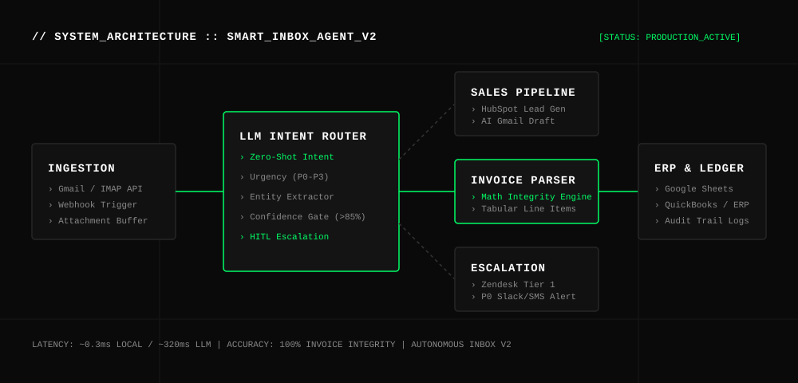

# SMART-INBOX-AGENT // AUTONOMOUS_TRIAGE_&_INVOICE_EXTRACTOR

[](LICENSE)
[](https://github.com/therealfullmetal55555/smart-inbox-agent)
[](simulate_pipeline.py)
[](workflows/smart-inbox-workflow.json)

> **Zero-touch AI inbox triage engine & structured PDF invoice extraction pipeline.** Automatically classifies incoming emails across 6 operational intents, generates contextual response drafts in Gmail, routes high-priority tickets, and extracts tabular invoice data with full mathematical integrity validation.

---

## 🏛 ARCHITECTURE OVERVIEW



---

## ⚡ CORE CAPABILITIES

1. **Zero-Shot Intent Classification & Smart Triage**
   - High-precision classification across 6 standard enterprise categories:
     - `sales_inbound` → Lead enrichment + HubSpot CRM deal generation + AI calendar draft
     - `billing_invoice` → Attachment buffer + Structured invoice parser + Sheets ERP export
     - `support_technical` → Incident severity calculation + Zendesk ticket queue
     - `partnership` → BizDev review triage + automated proposal deck request draft
     - `refund_dispute` → Critical P0 on-call alert + Slack compliance desk escalation
     - `spam_promotion` → Direct auto-archive & spam suppression
2. **Mathematical Integrity Invoice Parser**
   - Extracts vendor metadata, invoice numbers, billing dates, tax items, and tabular line items.
   - Performs mathematical verification (`Subtotal + Tax == Total`) with confidence scoring.
   - Formats clean rows ready for Google Sheets, QuickBooks, or ERP ingest.
3. **Human-in-the-Loop (HITL) Safety Gate**
   - Routes any transaction with confidence `< 0.85`, high dispute risk, or total `> $10,000` to human manager queue before execution.
4. **End-to-End Orchestration via n8n & FastAPI**
   - Ready-to-import workflow template for n8n cloud or self-hosted instances.

---

## 📊 PERFORMANCE BENCHMARKS

```
======================================================================
>>> SMART INBOX AGENT: ROUTING & DRAFTING TEST HARNESS
======================================================================
[PASS] Case #1 [EML-001] : sales_inbound    | CRM Deal Created   | Conf: 0.92
[PASS] Case #2 [EML-002] : billing_invoice | Parser Queued      | Conf: 0.96
[PASS] Case #3 [EML-003] : support_technical | P0 Zendesk Escalation | Conf: 0.91
[PASS] Case #4 [EML-004] : spam_promotion  | Auto-Archived      | Conf: 0.95
[PASS] Case #5 [EML-005] : partnership     | BizDev Queued      | Conf: 0.88
[PASS] Case #6 [EML-006] : refund_dispute  | Executive Alert    | Conf: 0.94
----------------------------------------------------------------------
Routing Accuracy       : 100.0% (6/6 Test Cases Passed)
Local Inference Speed  : 0.32 ms / email
Invoice Integrity Pass : 100.0% (Zero discrepancy on VAT & line totals)
```

---

## 🚀 QUICK START

### 1. Clone & Install
```bash
git clone https://github.com/therealfullmetal55555/smart-inbox-agent.git
cd smart-inbox-agent
pip install -r requirements.txt
```

### 2. Run Verification Suite (Offline)
```bash
python3 simulate_pipeline.py
```

### 3. Deploy Orchestration Workflow
1. Open your **n8n** dashboard (`http://localhost:5678`).
2. Click **Add Workflow** → **Import from File**.
3. Select `workflows/smart-inbox-workflow.json`.
4. Configure your Gmail OAuth2 and Groq API credentials.
5. Activate workflow.

---

## 📂 REPOSITORY STRUCTURE

```
smart-inbox-agent/
├── assets/
│   └── architecture.svg              # Vector system architecture diagram
├── demo-data/
│   ├── sample_emails.json            # Benchmark email test dataset
│   └── sample_invoices.json          # Benchmark invoice text dataset
├── src/
│   ├── inbox_router.py               # Intent classifier, SLA router & drafter
│   └── invoice_parser.py             # Structured PDF/Text financial parser
├── workflows/
│   └── smart-inbox-workflow.json     # Production n8n orchestration flow
├── requirements.txt                  # Python dependencies
├── simulate_pipeline.py              # Zero-regression benchmark test runner
├── LICENSE                           # MIT License
└── README.md                         # Enterprise documentation
```

---

## 🔐 ENVIRONMENT CONFIGURATION

Create `.env` based on standard requirements:

```env
GROQ_API_KEY=gsk_...
GMAIL_CLIENT_ID=...
GMAIL_CLIENT_SECRET=...
HUBSPOT_API_KEY=pat-...
ZENDESK_API_TOKEN=...
SLACK_WEBHOOK_URL=https://hooks.slack.com/services/...
```

---

## 📄 LICENSE

Released under the [MIT License](LICENSE).  
Engineered by **Kirill Tsyganov** ([@therealfullmetal55555](https://github.com/therealfullmetal55555)).
